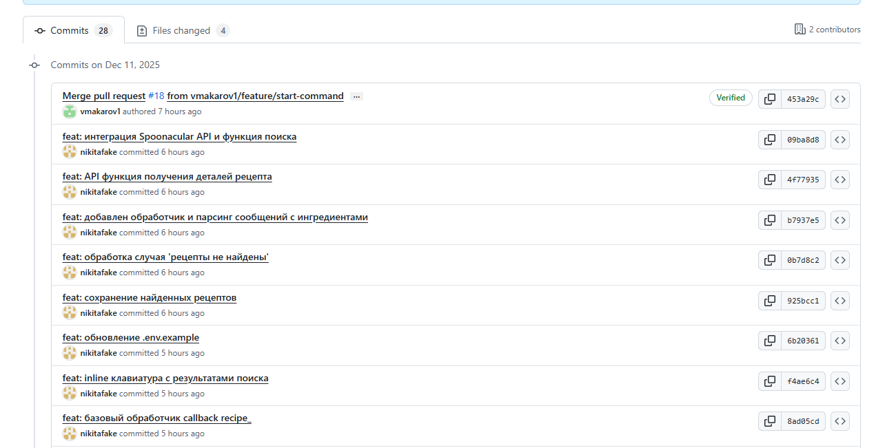

# Задания ЛР2

1.	Обновление локальных репозиториев (git pull origin main).
2.	Создание feature-веток для каждой задачи из To Do.
3.	Активная разработка в своих ветках. Небольшие, частые коммиты.
4.	Синхронизация: периодический push своих веток в удаленный репозиторий.
5.	Тимлид отслеживает прогресс на доске, перемещает задачи в In Progress.

# Отчёт о выполнении ЛР2

1. Изучили команды git pull, git checkout, git status git add, git commit, git branch
2. Внутри issues сделаны более мелкие sub-issues
3. В ходе разработки были созданы ветки https://github.com/vmakarov1/cook-bot/branches
4. Частые коммиты проще, чем один большой 