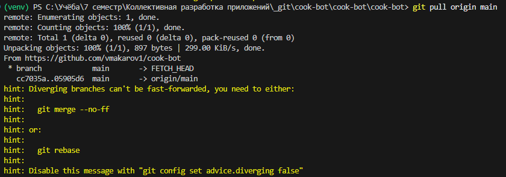
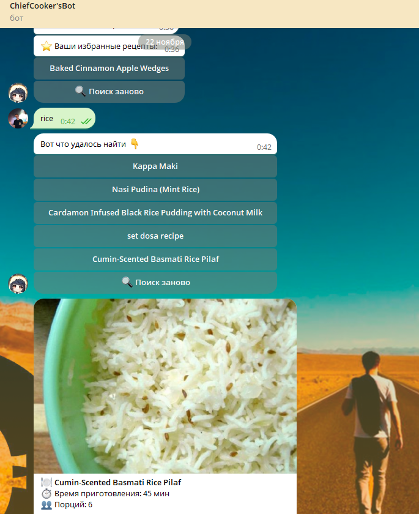

# Задания ЛР4

1.	Повторение цикла из Занятия 3: ветка -> разработка -> PR -> ревью -> мерж.
2.	Решение конфликтов, которые неизбежно возникнут при мерже.
3.	Написание простых тестов или сценариев для ручного тестирования.
4.	Рефакторинг: приведение кода к единому стилю, улучшение читаемости.
5.	Обновление README.md инструкцией по запуску и тестированию.

# Отчёт о выполнении ЛР4

1. Все остальные ветки проверены тимлидом и смерджены
2. Возник конфликт при мердже: . Подтянули main и переставили свои изменения сверху
3. Проведено ручное тестирование функционала 
4. Обновлён README, код приведён к единому стилю