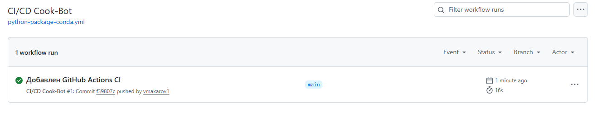

# Задания ЛР5

1.	Завершение всех задач из бэклога, кроме багов.
2.	Создание тегов/релизов в Git (v1.0.0).
3.	Настройка базового CI/CD (например, GitHub Action для запуска тестов или деплоя на GitHub Pages).
4.	Финальное тестирование всего приложения.
5.	Создание финальной версии README.md с описанием проекта, скриншотами, инструкцией по установке и запуску.

# Отчёт о выполнении ЛР1

1. Задачи завершены, issues закрыты
2. Добавлен тег в Git v1.0.0, первый релиз на GitHub https://github.com/vmakarov1/cook-bot/releases
3. Финальное тестирование показало, что виртуальное окружение (venv) упрощает запуск и тестирование
4. Добавлена финальная версия README.md
5. CI/CD тест успешно пройден 